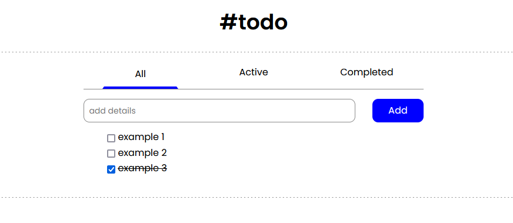
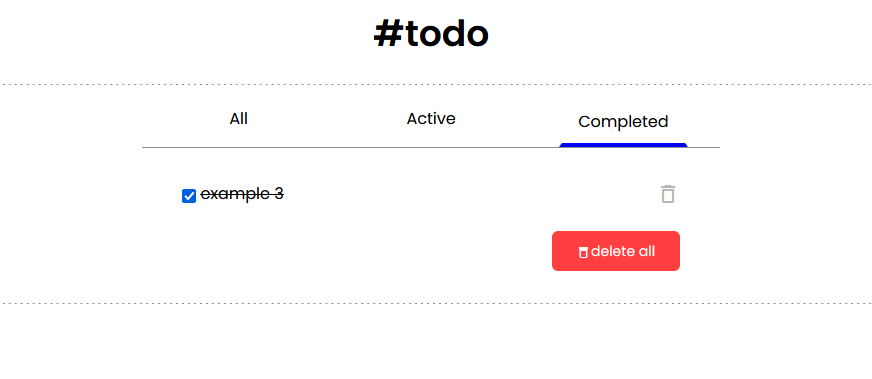

<!-- Please update value in the {}  -->

<h1 align="center">Todo app challenge</h1>

<div align="center">
   Solution for a challenge from  <a href="http://devchallenges.io" target="_blank">Devchallenges.io</a>.
</div>

<div align="center">
  <h3>
    <a href="https://stalwart-douhua-73b67c.netlify.app/">
      Demo
    </a>
    <span> | </span>
    <a href="https://github.com/yuandere/simple-todo">
      Solution
    </a>
    <span> | </span>
    <a href="https://devchallenges.io/challenges/hH6PbOHBdPm6otzw2De5">
      Challenge
    </a>
  </h3>
</div>

<!-- OVERVIEW -->

## Overview

|  |
| -- |
|  |

This is a simple todo app that utilizes localStorage to preserve tasks upon refresh and navigation away from the page.

### Built With

<!-- This section should list any major frameworks that you built your project using. Here are a few examples.-->

- [React](https://reactjs.org/)
- [Vite](https://vitejs.dev/)
- [Tachyons](http://tachyons.io/)

## Features

<!-- List the features of your application or follow the template. Don't share the figma file here :) -->

This application/site was created as a submission to a [DevChallenges](https://devchallenges.io/challenges) challenge. The [challenge](https://devchallenges.io/challenges/hH6PbOHBdPm6otzw2De5) was to build an application to complete the given user stories.

## How To Use

<!-- Example: -->

To clone and run this application, you'll need [Git](https://git-scm.com) and [Node.js](https://nodejs.org/en/download/) (which comes with [npm](http://npmjs.com)) installed on your computer. From your command line:

```bash
# Clone this repository
$ git clone https://github.com/your-user-name/your-project-name

# Install dependencies
$ npm install

# Run the app
$ npm start
```

## Acknowledgements

<!-- This section should list any articles or add-ons/plugins that helps you to complete the project. This is optional but it will help you in the future. For example: -->

- [Using localStorage with React Hooks](https://blog.logrocket.com/using-localstorage-react-hooks/)
- [Steps to replicate a design with only HTML and CSS](https://devchallenges-blogs.web.app/how-to-replicate-design/)
